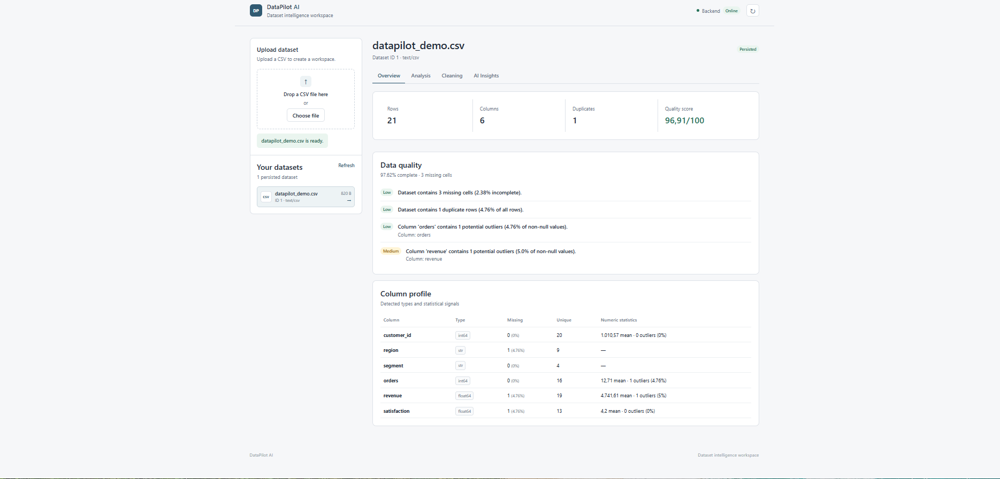
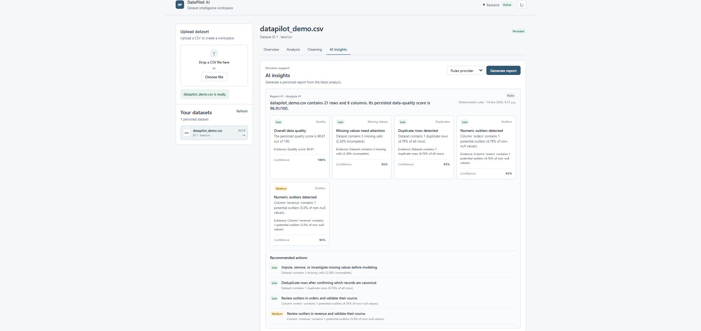
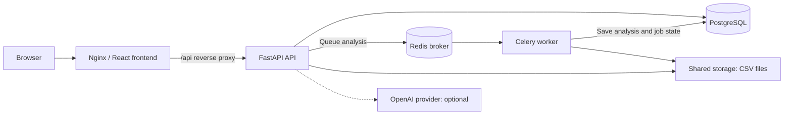

# DataPilot AI

[](https://github.com/samartzis47/DataPilot-AI/actions/workflows/ci.yml)

A full-stack data-quality and dataset intelligence platform for understanding, cleaning, and documenting CSV datasets. DataPilot AI combines a React dashboard with a FastAPI backend to turn uploaded files into profiles, saved analyses, cleaned exports, and actionable insight reports.

## Product screenshots



*Dataset overview with a quality score, missing-value and outlier warnings, and column statistics.*



*A saved rules-based report with supporting evidence and recommended actions.*

## The problem

CSV datasets often contain missing values, repeated records, and unusual numeric values that need investigation before analysis. Checking these issues manually makes it difficult to apply consistent rules and keep track of what changed.

DataPilot AI brings inspection, background analysis, configurable cleaning, and reporting into one workflow. It preserves uploaded files and records analyses, cleaning configurations, and insight reports so users can revisit their work.

## Key capabilities

- **CSV upload and dataset management:** Store uploaded files and dataset metadata, then reopen datasets from the dashboard.
- **Dataset profiling:** Inspect row and column counts, inferred types, unique values, missing values, and numeric statistics such as ranges, means, medians, and quartiles.
- **Data-quality assessment:** Calculate a score from completeness and duplicate frequency; flag missing values, duplicate rows, and potential numeric outliers using the interquartile range (IQR).
- **Asynchronous analysis:** Run dataset analysis through Celery and Redis, with persisted snapshots and job history covering status, attempts, timestamps, and failures.
- **Configurable cleaning:** Remove duplicates, fill numeric gaps with mean or median values, fill text gaps with the mode, and remove or clip numeric outliers. Save each cleaned version with its configuration and summary.
- **CSV export:** Download newly cleaned files or retrieve previous exports from cleaning history.
- **Persisted insights:** Generate structured reports and recommendations from saved analyses. The deterministic rules provider works without an API key; an optional OpenAI provider is available when configured and selected.
- **Responsive React dashboard:** Move between Overview, Analysis, Cleaning, and AI Insights, with loading states, error feedback, and job-status polling.

## Architecture



Nginx serves the React build and forwards same-origin `/api` requests to FastAPI, removing the prefix. PostgreSQL stores dataset metadata, analysis snapshots, job lifecycle records, cleaned-version metadata, and insight reports. Redis brokers background work; job state and analysis results are persisted in PostgreSQL.

The API and worker share `backend/storage`, mounted at `/app/storage` in both containers. Uploaded and cleaned CSV files live there, while database records retain their file references.

## Technology stack

| Area | Technologies |
| --- | --- |
| Backend | Python 3.14, FastAPI, Uvicorn, Pydantic, Pydantic Settings, SQLAlchemy, Psycopg, Alembic |
| Frontend | React 19, TypeScript, Vite, CSS, Fetch API |
| Data/AI | pandas, IQR outlier detection, deterministic insight rules, optional OpenAI Python SDK |
| Infrastructure | PostgreSQL 17, Redis 7.4, Celery, Docker, Docker Compose, Nginx, Node.js 24 for frontend builds |
| Quality | pytest, FastAPI TestClient/HTTPX, Vitest, React Testing Library, jsdom, ESLint, TypeScript checks, GitHub Actions |

## Quick start with Docker

Prerequisites:

- A local copy of this repository.
- Docker Desktop running with Linux containers and Docker Compose v2.
- PowerShell for the commands below.

From the repository root, create the backend environment file once:

```powershell
Copy-Item -Path backend/.env.example -Destination backend/.env
```

Set a local database password in `backend/.env` before the first start. `OPENAI_API_KEY` can remain empty to use the default rules provider. Adding a key makes OpenAI available when explicitly selected.

Build the images and start the frontend, API, worker, PostgreSQL, and Redis:

```powershell
docker compose up -d --build
```

The API applies Alembic migrations before starting. Check service status and follow application logs:

```powershell
docker compose ps
docker compose logs -f frontend api worker
```

- Frontend: [http://127.0.0.1:3000](http://127.0.0.1:3000)
- Swagger UI: [http://127.0.0.1:8000/docs](http://127.0.0.1:8000/docs)
- API health: [http://127.0.0.1:8000/health](http://127.0.0.1:8000/health)

Stop the stack while retaining local volume data:

```powershell
docker compose down
```

`docker compose down -v` deletes the local PostgreSQL and Redis volume data. Use it only when a complete reset of those services is intended. CSV files in the `backend/storage` bind mount remain on disk.

## Application workflow

1. **Upload a CSV.** Choose a file or use the dropzone; the dataset appears in the persisted dataset list.
2. **Inspect the profile.** Open Overview to review the quality score, missing values, duplicates, outliers, and column statistics.
3. **Run analysis.** Start a background job in Analysis. The dashboard polls its status and displays lifecycle details; a successful job saves an analysis snapshot.
4. **Clean the dataset.** Choose cleaning operations in Cleaning and create a separate, persisted CSV version with a recorded summary.
5. **Download the cleaned CSV.** Export the new copy or download an earlier version from cleaning history.
6. **Generate persisted insights.** Open AI Insights and generate a report from the latest saved analysis using the rules provider or a configured OpenAI provider.

Insight reports refer to saved analyses of the uploaded dataset. To generate insights about a cleaned export, upload that CSV as a new dataset and run an analysis on it first.

## API overview

Routes below are relative to `http://127.0.0.1:8000`. The dashboard reaches the same routes through Nginx under `/api`. Request and response schemas are available in [Swagger UI](http://127.0.0.1:8000/docs); implementations live in [backend/app/api/routes](backend/app/api/routes).

| Method | Route | Purpose |
| --- | --- | --- |
| GET | `/` | API metadata and documentation link |
| GET | `/health` | API liveness response |
| GET | `/datasets` | List persisted datasets |
| POST | `/datasets` | Create dataset metadata without uploading a file |
| POST | `/datasets/upload` | Upload a CSV and persist its metadata |
| GET | `/datasets/{dataset_id}` | Retrieve dataset metadata |
| GET | `/datasets/{dataset_id}/profile` | Compute the current dataset profile |
| POST | `/datasets/{dataset_id}/analyses` | Compute and save an analysis synchronously |
| GET | `/datasets/{dataset_id}/analyses` | List saved analyses |
| GET | `/datasets/{dataset_id}/analyses/{analysis_id}` | Retrieve an analysis snapshot |
| POST | `/datasets/{dataset_id}/analysis-jobs` | Queue background analysis; returns HTTP 202 |
| GET | `/datasets/{dataset_id}/analysis-jobs` | List analysis jobs |
| GET | `/datasets/{dataset_id}/analysis-jobs/{job_id}` | Retrieve job status and lifecycle details |
| POST | `/datasets/{dataset_id}/cleanings` | Create a cleaned CSV and save its configuration and summary |
| GET | `/datasets/{dataset_id}/cleanings` | List cleaned versions |
| GET | `/datasets/{dataset_id}/cleanings/{cleaning_id}` | Retrieve a cleaning record |
| GET | `/datasets/{dataset_id}/cleanings/{cleaning_id}/download` | Download a cleaned CSV |
| POST | `/datasets/{dataset_id}/insights` | Generate and save an insight report from a persisted analysis |
| GET | `/datasets/{dataset_id}/insights` | List saved insight reports |
| GET | `/datasets/{dataset_id}/insights/{insight_id}` | Retrieve an insight report |

Analysis, job, cleaning, and insight history endpoints accept `limit` (default `20`, maximum `100`) and `offset` (default `0`). Insight creation accepts a provider and an optional `analysis_id`; it uses the latest saved analysis when that ID is omitted.

## Testing and continuous integration

The [CI workflow](.github/workflows/ci.yml) runs on pushes to `main`, pull requests targeting `main`, and manual dispatch.

| Check | What runs |
| --- | --- |
| Backend | Python 3.14 dependency installation and `python -m pytest -q`, with PostgreSQL and Redis services available |
| Migrations | `python -m alembic upgrade head`, `python -m alembic current`, and `python -m alembic check` against PostgreSQL |
| Frontend | Node.js 24, `npm ci`, `npx tsc --noEmit`, `npm run lint`, `npm test -- --run`, and `npm run build` |
| Docker images | After backend and frontend checks succeed, `docker compose config` validates configuration and `docker compose build` builds the images |

Backend tests cover upload validation, profiling, quality scoring, outlier detection, analysis persistence, job submission and completion, cleaning and downloads, and insight generation. API tests use isolated SQLite databases and temporary file storage, with mocked queue submission and OpenAI calls. The PostgreSQL migration checks verify schema alignment separately.

Frontend tests cover CSV validation, API error handling, job polling, accessible error rendering, and displaying persisted insight reports. The build script also runs TypeScript project compilation before creating the Vite bundle.

For local development and test setup, see the [backend guide](backend/README.md) and [frontend guide](frontend/README.md).

## Project structure

```text
DataPilot-AI/
|-- .github/workflows/ci.yml       # Backend, frontend, migration, and image checks
|-- backend/
|   |-- app/
|   |   |-- api/                  # FastAPI routes and dependencies
|   |   |-- core/                 # Settings and Celery configuration
|   |   |-- db/                   # SQLAlchemy base and sessions
|   |   |-- models/               # Persisted entities
|   |   |-- schemas/              # Request and response schemas
|   |   |-- crud/                 # Database operations
|   |   |-- services/             # Profiling, quality, cleaning, and insights
|   |   `-- tasks/                # Background analysis task
|   |-- alembic/versions/         # Versioned database migrations
|   |-- tests/
|   |-- .env.example
|   |-- Dockerfile
|   `-- requirements.txt
|-- frontend/
|   |-- src/
|   |   |-- api/                  # Typed HTTP client
|   |   |-- components/           # Dashboard panels and component tests
|   |   |-- types/                # API request and response interfaces
|   |   `-- utils/                # Validation, polling, formatting, and tests
|   |-- .env.example
|   |-- Dockerfile
|   |-- nginx.conf
|   `-- package.json
|-- docs/images/                  # Product screenshots
|-- compose.yaml
`-- README.md
```

## Configuration

Backend settings are loaded through Pydantic Settings. Use [backend/.env.example](backend/.env.example) as the template for a local `backend/.env`; local environment files are excluded from Git.

| Variable | Purpose / template default |
| --- | --- |
| `APP_NAME` | API title; `DataPilot-AI` |
| `APP_VERSION` | API version metadata; `0.1.0` |
| `ENVIRONMENT` | Environment label; `development` |
| `POSTGRES_USER` | Database username |
| `POSTGRES_PASSWORD` | Database password; replace the template placeholder locally |
| `POSTGRES_DB` | Database name; `datapilot` |
| `POSTGRES_HOST` | Database hostname; `localhost` |
| `POSTGRES_PORT` | Database port; `5432` |
| `REDIS_URL` | Celery broker URL; `redis://localhost:6379/0` |
| `OPENAI_API_KEY` | Optional credential; empty by default |
| `OPENAI_MODEL` | Model used when OpenAI is selected; `gpt-4o-mini` |
| `OPENAI_TIMEOUT_SECONDS` | OpenAI request timeout in seconds; `30` |
| `OPENAI_MAX_RETRIES` | OpenAI client retry limit; `2` |

Compose overrides `POSTGRES_HOST` to `db` and `REDIS_URL` to `redis://redis:6379/0` for the API and worker, so the template's local hostnames need no Docker-specific edits.

[frontend/.env.example](frontend/.env.example) defines `VITE_API_BASE_URL=/api`, the build-time base path used by the typed API client. The frontend Docker build sets `/api` explicitly. Nginx and the Vite development proxy forward this path to FastAPI.

The rules provider remains the default even when an OpenAI key is present. Selecting OpenAI requires a configured key; provider errors are returned to the caller without automatic failover to rules.

## Engineering highlights

- **Persistence with traceable history:** SQLAlchemy models connect datasets, analysis snapshots, jobs, cleaned versions, and insights through foreign keys. PostgreSQL JSONB stores structured reports and cleaning configurations.
- **Background processing:** Celery handles analysis with retries, while PostgreSQL records job lifecycle state. The worker commits a successful analysis and its job-completion update in the same transaction.
- **Migration safety:** Versioned Alembic migrations run before the API starts. A migration failure prevents startup, and CI checks the migrated schema against model metadata.
- **Container operation:** The API and worker run as a non-root user; the frontend uses an unprivileged Nginx image. PostgreSQL, Redis, API, and frontend health checks control Compose startup dependencies.
- **Shared file storage:** The API and worker access the same CSV directory. Cleaning creates separate files, and failed database writes trigger cleanup of newly created output files.
- **Frontend integration:** A typed Fetch API client centralizes requests and error handling. Nginx reverse proxying keeps browser traffic on the frontend origin, while polling follows background analysis jobs.
- **Deterministic AI fallback:** The default rules provider offers reproducible insight generation without external credentials. The optional OpenAI provider validates structured output and receives a statistical report with its row preview removed.

## Roadmap

Future work:

- Authentication and user workspaces.
- Cloud deployment with managed services and environment-specific configuration.
- Observability through structured logs, metrics, and tracing.
- Larger-file processing with chunked ingestion and memory-aware analysis.
- Richer visualizations and ML-assisted recommendations.

## Author

Efthimis Samartzis

GitHub: [samartzis47](https://github.com/samartzis47)
